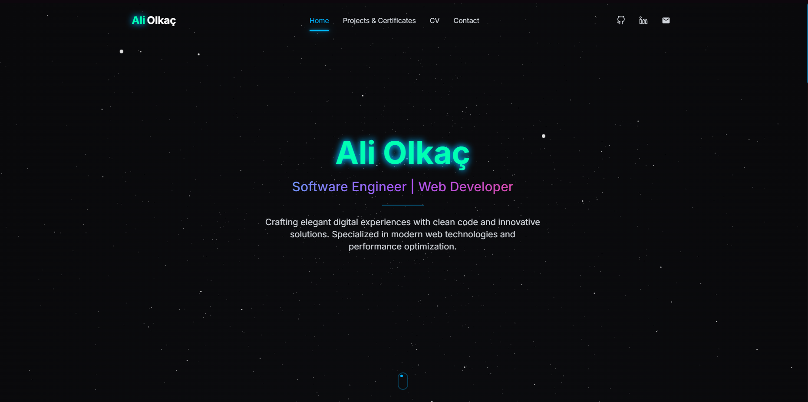

# Ali Olkaç Portfolio Website

#                       aliolkac.com.tr

## 📋 About the Project



This project is a modern and interactive portfolio website. It is developed using Next.js 15, React 19, TypeScript, and Tailwind CSS. It includes 3D models, animations, and interactive components. The project is designed to showcase my software development skills, projects, and experiences.

## 🚀 Features

- ✨ Modern, responsive, and interactive UI/UX design
- 🎨 Customized styles with Tailwind CSS
- 🌐 High-performance website developed with Next.js and React
- 📱 Responsive design compatible with all devices (Mobile, Tablet, Desktop)
- 🔄 Smooth animations with Framer Motion
- 📊 GitHub contribution graph integration
- 📝 Detailed CV and portfolio sections
- 📑 Certificate gallery
- 🔍 SEO optimization

## 🛠️ Technologies

- **Frontend**:
  - Next.js 15
  - React 19
  - TypeScript
  - Tailwind CSS
  - Framer Motion (Animations)

- **Optimization**:
  - Next.js Image Optimization
  - WebP format support
  - Critters (CSS optimization)
  - Lazy Loading
  - Code Splitting

- **Other Tools**:
  - ESLint and Prettier (Code quality)
  - Husky (Git hooks)
  - Next.js Bundle Analyzer (Bundle optimization)

## 💻 Setup and Run

### Requirements

- Node.js (at least v18.17 or higher)
- npm or yarn

### Installation Steps

1. Clone the project:
   ```bash
   git clone https://github.com/AliOlkac/SoftwarePortfolio.git
   cd SoftwarePortfolio
   ```

2. Install dependencies:
   ```bash
   npm install
   # or
   yarn install
   ```

3. Start the development server:
   ```bash
   npm run dev
   # or
   yarn dev
   ```

4. Open in your browser: [http://localhost:3000]

### Building for Production

1. Optimize images and PDFs:
   ```bash
   npm run optimize
   # or
   yarn optimize
   ```

2. Build the production version:
   ```bash
   npm run build
   # or
   yarn build
   ```

3. Start the production server:
   ```bash
   npm run start
   # or
   yarn start
   ```

## 📂 Project Structure

```
AliOlkac_Portfolio/
├── app/                    # Next.js 15 app router
│   ├── contact/            # Contact page
│   ├── cv/                 # CV page
│   ├── projects/           # Projects page
│   ├── page.tsx            # Main page
│   ├── layout.tsx          # Main layout
│   └── globals.css         # Global CSS
├── components/             # React components
│   ├── sections/           # Main section components
│   ├── shared/             # Shared components
│   ├── ui/                 # UI components
│   └── providers/          # Context providers
├── lib/                    # Helper functions
├── public/                 # Static files
│   ├── images/             # Images
│   ├── projects/           # Project images
│   ├── certificates/       # Certificate images
│   ├── cv/                 # CV files
│   └── fonts/              # Fonts
├── scripts/                # Build and optimization scripts
├── styles/                 # Additional style files
├── tailwind.config.ts      # Tailwind configuration
├── next.config.js          # Next.js configuration
└── package.json            # Project dependencies
```

## 🔧 Performance Optimizations

To provide the best user experience, the project includes various optimizations:

1. **Image Optimization**:
   - WebP format support
   - Lazy loading
   - Automatic resizing
   - Image caching

2. **JS & CSS Optimization**:
   - Code splitting
   - Critical CSS inlining (Critters)
   - Tree-shaking

3. **Performance Monitoring**:
   - Bundle analyzer integration
   - Measurement of performance metrics

## 🤝 Contributing

1. Fork the Project
2. Create your Feature Branch (`git checkout -b feature/amazing-feature`)
3. Commit your Changes (`git commit -m 'Add some amazing feature'`)
4. Push to the Branch (`git push origin feature/amazing-feature`)
5. Open a Pull Request

## 📝 License

This project is licensed under the [MIT](LICENSE) License.

## 📬 Contact

- **Website**: [aliolkac.com.tr](https://aliolkac.com.tr)
- **Email**: [iletisim@aliolkac.com](mailto:iletisim@aliolkac.com)
- **GitHub**: [@aliolkac](https://github.com/aliolkac)
- **LinkedIn**: [Ali Olkaç](https://linkedin.com/in/aliolkac)

---

<div align="center">
  <p>© 2025 Ali Olkaç. All rights reserved.</p>
</div>
